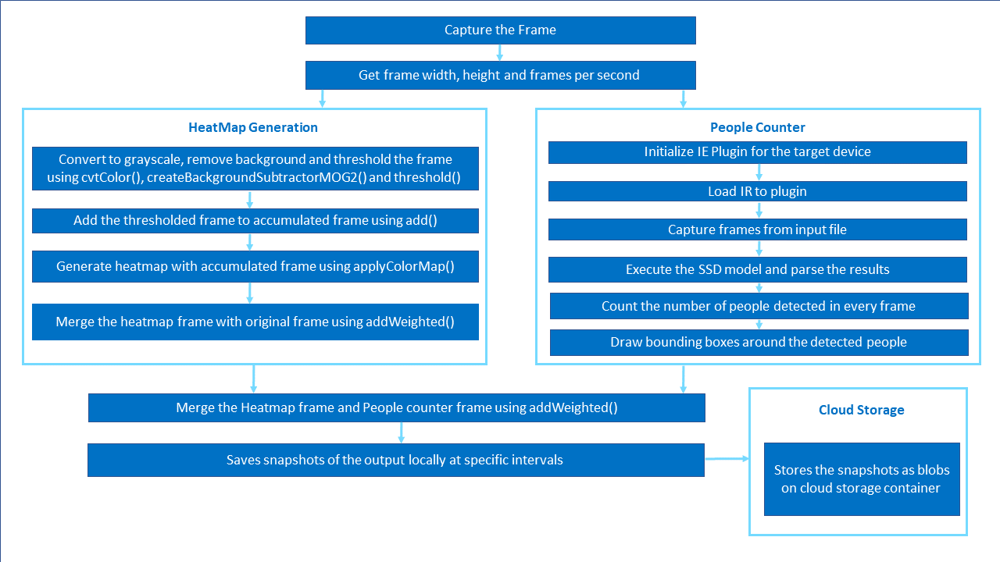
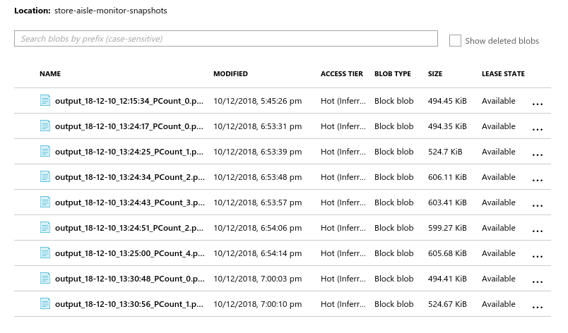

# Store Aisle Monitor


| Details               |                  |
|-----------------------|------------------|
| Target OS             |  Ubuntu\* 16.04 LTS     |
| Programming Language  |  Python* 3.5 |
| Time to complete      |  30 min      |

This reference implementation is also [available in C++](https://github.com/intel-iot-devkit/reference-implementation-private/blob/master/store-aisle-monitor/README.md)


## Introduction

This reference implementation counts the number of people present in an image and generates a motion heatmap. It takes the input from the camera, or a video file for processing. Snapshots of the output are taken at regular intervals and are uploaded to the cloud. It also stores the snapshots of the output locally.

## Requirements

### Hardware
*  6th to 8th generation Intel® Core™ processors with Intel® Iris® Pro graphics or Intel® HD Graphics

### Software

* [Ubuntu* 16.04](http://releases.ubuntu.com/16.04/)
* OpenCL™ Runtime Package<br>
  **Note**: We recommend using a 4.14+ kernel to use this software. Run the following command to determine your kernel version:
  ```  
  uname -a
  ```  
* Intel® Distribution of OpenVINO™ toolkit 2019 R3 Release
* Microsoft Azure* Python SDK

## How it Works
- The application uses a video source, such as a camera or a video file, to grab the frames. The [OpenCV functions](https://docs.opencv.org/3.4/dd/d43/tutorial_py_video_display.html) are used to calculate frame width, frame height and frames per second (fps) of the video source. The application counts the number of people and generates motion heatmap.


-  People counter: A trained neural network model detects the people in the frame and bounding boxes are drawn on the people detected. This reference implementation uses a pre-trained model **person-detection-retail-0013** that can be downloaded using the **model downloader**, provided by the Intel® Distribution of OpenVINO™ toolkit.

- Motion Heatmap generation: An accumulated frame is used, on which every frame is added after preprocessing. This accumulated frame is used to generate the motion heatmap using [applyColorMap](https://docs.opencv.org/3.4/d3/d50/group__imgproc__colormap.html#gadf478a5e5ff49d8aa24e726ea6f65d15). The original frame and heatmap frame are merged using [addWeighted](https://docs.opencv.org/3.0-beta/doc/py_tutorials/py_core/py_image_arithmetics/py_image_arithmetics.html), to visualize the movement patterns over time.

-  The heatmap frame and people counter frame are merged using [addWeighted](https://docs.opencv.org/3.0-beta/doc/py_tutorials/py_core/py_image_arithmetics/py_image_arithmetics.html) and this merged frame is saved locally at regular intervals. The output is present in the *application/output_snapshots* directory of the project directory.

-  The application also uploads the results to the Microsoft Azure cloud at regular intervals, if a Microsoft Azure storage name and key are provided.

    

## Setup
### Get the code
Clone the reference implementation
```
sudo apt-get update && sudo apt-get install git
git clone https://gitlab.devtools.intel.com/reference-implementations/store-aisle-monitor-python.git
```

### Install Intel® Distribution of OpenVINO™ toolkit

Refer to [https://software.intel.com/en-us/articles/OpenVINO-Install-Linux](https://software.intel.com/en-us/articles/OpenVINO-Install-Linux) for more information on how to install and setup the Intel® Distribution of OpenVINO™ toolkit.

The OpenCL™ Runtime package is required to run the inference on a GPU. It is not mandatory for CPU inference.

### Other dependencies
**Microsoft Azure python SDK**<br>
The Azure python SDK allows you to build applications against Microsoft Azure Storage. [Azure Storage](https://docs.microsoft.com/en-us/azure/storage/common/storage-introduction) is Microsoft's cloud storage solution for modern data storage scenarios. Azure Storage offers a massively scalable object store for data objects, a file system service for the cloud, a messaging store for reliable messaging, and a NoSQL store.


### Which model to use

This application uses the [**person-detection-retail-0013**](https://docs.openvinotoolkit.org/2019_R3/_models_intel_person_detection_retail_0013_description_person_detection_retail_0013.html) Intel® pre-trained model, that can be accessed using the **model downloader**. The **model downloader** downloads the __.xml__ and __.bin__ files that will be used by the application.

To download the model and install the dependencies of the application, run the below command in the `store-aisle-monitor-python` directory:
```
./setup.sh
```

### The Config File

The _resources/config.json_ contains the path of video that will be used by the application as input.

For example:
   ```
   {
       "inputs": [
          {
              "video":"path_to_video/video1.mp4"
          }
       ]
   }
   ```

The `path/to/video` is the path to an input video file.

### Which Input Video to use

We recommend using [store-aisle-detection](https://raw.githubusercontent.com/intel-iot-devkit/sample-videos/master/store-aisle-detection.mp4).
For example:
   ```
   {
       "inputs": [
          {
              "video":"sample-videos/store-aisle-detection.mp4
          }
       ]
   }
   ```
If the user wants to use any other video, it can be used by providing the path in the config.json file.


### Using the Camera Stream instead of video

Replace `path/to/video` with the camera ID in the config.json file, where the ID is taken from the video device (the number X in /dev/videoX).

On Ubuntu, to list all available video devices use the following command:

```
ls /dev/video*
```

For example, if the output of above command is __/dev/video0__, then config.json would be:

```
  {
     "inputs": [
        {
           "video":"0"
        }
     ]
  }
```

### Setup the environment

Configure the environment to use the Intel® Distribution of OpenVINO™ toolkit one time per session by running the following command:

    source /opt/intel/openvino/bin/setupvars.sh -pyver 3.5

**Note:** This command needs to be executed only once in the terminal where the application will be executed. If the terminal is closed, the command needs to be executed again.

## Run the application
Change the current directory to the git-cloned application code location on your system:
```
cd <path_to_the_store-aisle-monitor-python_directory>/application
```
To see a list of the various options:

    python3 store_aisle_monitor.py --help

A user can specify what target device to run on by using the device command-line argument `-d` followed by one of the values `CPU`, `GPU`, `HDDL`, `MYRIAD` or `HETERO:FPGA,CPU`.
To run with multiple devices use -d MULTI:device1,device2. For example: `-d MULTI:CPU,GPU,HDDL`
If no target device is specified the application will run on the CPU by default.

### Run on the CPU

Although the application runs on the CPU by default, this can also be explicitly specified through the `-d CPU` command-line argument:

    python3 store_aisle_monitor.py -m /opt/intel/openvino/deployment_tools/open_model_zoo/tools/downloader/intel/person-detection-retail-0013/FP32/person-detection-retail-0013.xml -l /opt/intel/openvino/inference_engine/lib/intel64/libcpu_extension_sse4.so -d CPU -pt 0.7
To run the application on sync mode, use `-f sync` as command line argument. By default, the application runs on async mode.

### Run on the Integrated GPU

* To run on the integrated Intel® GPU in 32-bit mode, use the below command.
    ```
    python3 store_aisle_monitor.py -m /opt/intel/openvino/deployment_tools/open_model_zoo/tools/downloader/intel/person-detection-retail-0013/FP32/person-detection-retail-0013.xml -d GPU -pt 0.7
    ```
    **FP32**: FP32 is single-precision floating-point arithmetic uses 32 bits to represent numbers. 8 bits for the magnitude and 23 bits for the precision. For more information, [click here](https://en.wikipedia.org/wiki/Single-precision_floating-point_format)<br>

* To run on the integrated Intel® GPU in 16-bit mode, use the below command.
    ```
    python3 store_aisle_monitor.py -m /opt/intel/openvino/deployment_tools/open_model_zoo/tools/downloader/intel/person-detection-retail-0013/FP16/person-detection-retail-0013.xml -d GPU -pt 0.7
    ```
   **FP16**: FP16 is half-precision floating-point arithmetic uses 16 bits. 5 bits for the magnitude and 10 bits for the precision. For more information, [click here](https://en.wikipedia.org/wiki/Half-precision_floating-point_format)
    
### Run on the Intel® Neural Compute Stick
To run on the Intel® Neural Compute Stick, use the ```-d MYRIAD``` command-line argument:

    python3 store_aisle_monitor.py -d MYRIAD -m /opt/intel/openvino/deployment_tools/open_model_zoo/tools/downloader/intel/person-detection-retail-0013/FP16/person-detection-retail-0013.xml -pt 0.7

**Note:** The Intel® Neural Compute Stick can only run FP16 models. The model that is passed to the application, through the `-m <path_to_model>` command-line argument, must be of data type FP16.

### Run on the Intel® Movidius™ VPU
To run on the Intel® Movidius™ VPU, use the `-d HDDL` command-line argument:

    python3 store_aisle_monitor.py -m /opt/intel/openvino/deployment_tools/open_model_zoo/tools/downloader/intel/person-detection-retail-0013/FP16/person-detection-retail-0013.xml -d HDDL

**Note:** The HDDL-R can only run FP16 models. The model that is passed to the application, through the `-m <path_to_model>` command-line argument, must be of data type FP16.

### Run on the Intel® Arria® 10 FPGA

Before running the application on the FPGA, set the environment variables and  program the AOCX (bitstream) file.<br>

Set the Board Environment Variable to the proper directory:

```
export AOCL_BOARD_PACKAGE_ROOT=/opt/intel/openvino/bitstreams/a10_vision_design_sg<#>_bitstreams/BSP/a10_1150_sg<#>
```
**NOTE**: If you do not know which version of the board you have, please refer to the product label on the fan cover side or by the product SKU: Mustang-F100-A10-R10 => SG1; Mustang-F100-A10E-R10 => SG2 <br>

Set the Board Environment Variable to the proper directory: 
```
export QUARTUS_ROOTDIR=/home/<user>/intelFPGA/18.1/qprogrammer
```
Set the remaining environment variables:
```
export PATH=$PATH:/opt/altera/aocl-pro-rte/aclrte-linux64/bin:/opt/altera/aocl-pro-rte/aclrte-linux64/host/linux64/bin:/home/<user>/intelFPGA/18.1/qprogrammer/bin
export INTELFPGAOCLSDKROOT=/opt/altera/aocl-pro-rte/aclrte-linux64
export LD_LIBRARY_PATH=$LD_LIBRARY_PATH:$AOCL_BOARD_PACKAGE_ROOT/linux64/lib
export CL_CONTEXT_COMPILER_MODE_INTELFPGA=3
source /opt/altera/aocl-pro-rte/aclrte-linux64/init_opencl.sh
```
**NOTE**: It is recommended to create your own script for your system to aid in setting up these environment variables. It will be run each time you need a new terminal or restart your system. 

The bitstreams for HDDL-F can be found under the `/opt/intel/openvino/bitstreams/a10_vision_design_sg<#>_bitstreams/` directory.<br><br>To program the bitstream use the below command:<br>
```
aocl program acl0 /opt/intel/openvino/bitstreams/a10_vision_design_sg<#>_bitstreams/2019R3_PV_PL1_FP11_RMNet.aocx
```

For more information on programming the bitstreams, please refer to [OpenVINO-Install-Linux-FPGA](https://software.intel.com/en-us/articles/OpenVINO-Install-Linux-FPGA#inpage-nav-11)

To run the application on the FPGA with floating point precision 16 (FP16), use the `-d HETERO:FPGA,CPU` command-line argument:<br>

    python3 store_aisle_monitor.py -m /opt/intel/openvino/deployment_tools/open_model_zoo/tools/downloader/intel/person-detection-retail-0013/FP16/person-detection-retail-0013.xml -l /opt/intel/openvino/inference_engine/lib/intel64/libcpu_extension_sse4.so -d HETERO:FPGA,CPU


## (Optional) Saving snapshots to the Cloud 
To upload the results to the cloud, the Microsoft Azure storage name and storage key are provided as the command line arguments.
Use `-an` and `-ak` options to specify Microsoft Azure storage name and storage key respectively.

    python3 store_aisle_monitor.py -m /opt/intel/openvino/deployment_tools/open_model_ -l /opt/intel/openvino/inference_engine/lib/intel64/libcpu_extension_sse4.so -d CPU -pt 0.7 -an <azure-account-name> -ak <azure-account-key>

**Note:** <br>
To obtain account name and account key from the Microsoft Azure portal, please refer:
https://docs.microsoft.com/en-us/azure/storage/blobs/storage-quickstart-blobs-python#copy-your-credentials-from-the-azure-portal

To view the uploaded snapshots on cloud, please refer:
https://docs.microsoft.com/en-us/azure/storage/blobs/storage-upload-process-images?tabs=net#verify-the-image-is-shown-in-the-storage-account
