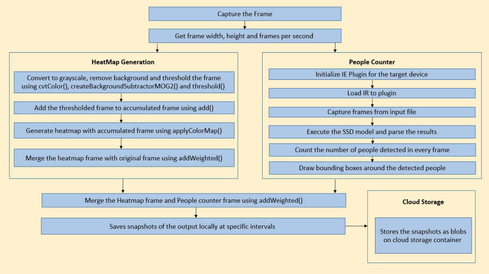
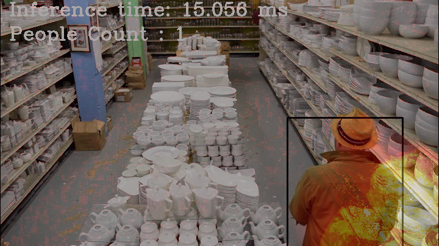
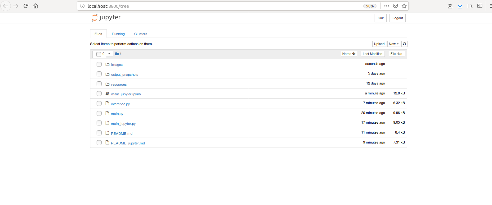
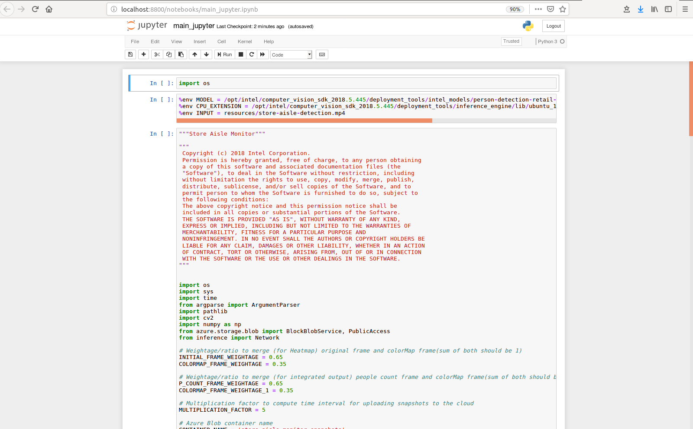

# Store Aisle Monitor


| Details               |                  |
|-----------------------|------------------|
| Target OS             |  Ubuntu\* 16.04 LTS     |
| Programming Language  |  Python* 3.5 |
| Time to complete      |  30 min      |


## Introduction

This reference implementation counts the number of people present in an image and generates a motion heatmap. It takes the input from the camera, or a video file for processing. Snapshots of the output are taken at regular intervals and are uploaded to the cloud. It also stores the snapshots of the output locally.

## Requirements

### Hardware
*  6th to 8th generation Intel® Core™ processor with Intel® Iris® Pro graphics or Intel® HD Graphics

### Software

* [Ubuntu* 16.04](http://releases.ubuntu.com/16.04/)
* OpenCL™ Runtime Package<br>
  **Note**: We recommend using a 4.14+ kernel to use this software. Run the following command to determine your kernel version:
  ```  
  uname -a
  ```  
* Intel® Distribution of OpenVINO™ toolkit 2019 R1 Release
* Microsoft Azure* Python SDK

## Setup

### Install Intel® Distribution of OpenVINO™ toolkit

Refer to [https://software.intel.com/en-us/articles/OpenVINO-Install-Linux](https://software.intel.com/en-us/articles/OpenVINO-Install-Linux) for more information on how to install and setup the Intel® Distribution of OpenVINO™ toolkit.

The OpenCL™ Runtime package is required to run the inference on a GPU. It is not mandatory for CPU inference.

### Install Python* dependencies
```
sudo apt-get install python3-pip
pip3 install azure numpy jupyter
```

## How it Works
- The application uses a video source, such as a camera or a video file, to grab the frames. The [OpenCV functions](https://docs.opencv.org/3.4/dd/d43/tutorial_py_video_display.html) are used to calculate frame width, frame height and frames per second (fps) of the video source. The application counts the number of people and generates motion heatmap.


-  People counter: A trained neural network model detects the people in the frame and bounding boxes are drawn on the people detected. This reference implementation uses a pre-trained model **person-detection-retail-0013** that can be downloaded using the **model downloader**, provided by the Intel® Distribution of OpenVINO™ toolkit.  

- Motion Heatmap generation: An accumulated frame is used, on which every frame is added after preprocessing. This accumulated frame is used to generate the motion heatmap using [applyColorMap](https://docs.opencv.org/3.4/d3/d50/group__imgproc__colormap.html#gadf478a5e5ff49d8aa24e726ea6f65d15). The original frame and heatmap frame are merged using [addWeighted](https://docs.opencv.org/3.0-beta/doc/py_tutorials/py_core/py_image_arithmetics/py_image_arithmetics.html), to visualize the movement patterns over time.

-  The heatmap frame and people counter frame are merged using [addWeighted](https://docs.opencv.org/3.0-beta/doc/py_tutorials/py_core/py_image_arithmetics/py_image_arithmetics.html) and this merged frame is saved locally at regular intervals. The output is present in the *output_snapshots* directory of the project directory.

    

-  The application also uploads the results to the Microsoft Azure cloud at regular intervals, if a Microsoft Azure storage name and key are provided. 
    

## Download the model

This application uses the **person-detection-retail-0013** Intel® pre-trained model, that can be accessed using the **model downloader**. The **model downloader** downloads the __.xml__ and __.bin__ files that will be used by the application.

Steps to download .xml and .bin files:<br>

* Go to the **model downloader** directory using following command:

      cd /opt/intel/openvino/deployment_tools/tools/model_downloader

* Specify which model to download with `--name`.<br>
  To download the **person-detection-retail-0013** model, run the following command:

      sudo ./downloader.py --name person-detection-retail-0013

* To download the **person-detection-retail-0013** model for **FP16**, run the following command:

      sudo ./downloader.py --name person-detection-retail-0013-fp16
 
The model will be downloaded inside the following directory:
 
    /opt/intel/openvino/deployment_tools/tools/model_downloader/Retail/object_detection/pedestrian/rmnet_ssd/0013/dldt/

## Setup the environment

You must configure the environment to use the Intel® Distribution of OpenVINO™ toolkit one time per session by running the following command:

    source /opt/intel/openvino/bin/setupvars.sh -pyver 3.5


## Run the application on Jupyter*

Start by changing the current directory to wherever you have git cloned the application code. For example:

```
cd <path_to_the_store-aisle-python_directory>
```

### Sample Video

You can download sample video by running following commands:

```
mkdir resources
cd resources
wget https://github.com/intel-iot-devkit/sample-videos/raw/master/store-aisle-detection.mp4
cd .. 
```

## Open Jupyter* notebook

**Note:**<br>
Before running the application on the FPGA, program the AOCX (bitstream) file. Use the setup_env.sh script from [fpga_support_files.tgz](http://registrationcenter-download.intel.com/akdlm/irc_nas/12954/fpga_support_files.tgz) to set the environment variables.<br>
For example:

    source /home/<user>/Downloads/fpga_support_files/setup_env.sh
    
The bitstreams for HDDL-F can be found under the `/opt/intel/openvino/bitstreams/a10_vision_design_bitstreams` folder.<br>To program the bitstream use the below command:<br>
    
    aocl program acl0 /opt/intel/openvino/bitstreams/a10_vision_design_bitstreams/2019R1_PL1_FP11_RMNet.aocx
    
For more information on programming the bitstreams, please refer to https://software.intel.com/en-us/articles/OpenVINO-Install-Linux-FPGA#inpage-nav-11<br>
<br>

* To open the Jupyter notebook, run the following command.
    ```
    jupyter notebook
    ```

    

**Follow the steps to run the code on Jupyter:**

1. Click on **New** button on the right side of the Jupyter window.

2. Click on **Python 3** option from the drop down list.

3. In the first cell type **import os** and press **Shift+Enter** from the keyboard.

4. Export the below environment variables in second cell of Jupyter and press **Shift+Enter**.
    ```
    %env MODEL = /opt/intel/openvino/deployment_tools/tools/model_downloader/Retail/object_detection/pedestrian/rmnet_ssd/0013/dldt/person-detection-retail-0013.xml
    %env CPU_EXTENSION = /opt/intel/openvino/inference_engine/lib/intel64/libcpu_extension_sse4.so 
    %env INPUT = resources/store-aisle-detection.mp4
    ```
5. User can set the threshold for the detection (PROB_THRESHOLD) and target device to infer on (DEVICE).
   Export these environment variables as given below if required, else skip this step. If user skips this step, these values are set to default values.
   ```
   %env DEVICE = CPU
   %env PROB_THRESHOLD = 0.7
   ```
 
6. To upload the results to the Microsoft Azure cloud (optional), export the below environment variables with an appropriate Microsoft Azure storage name and key.
   ```
   %env ACCOUNT_NAME = <enter-azure-account-name>
   %env ACCOUNT_KEY = <enter-azure-account-key>
   ```    
   
7.  Copy the code from **main_jupyter.py** and paste it in the next cell and press **Shift+Enter**.

8. Alternatively, code can be run in the following way:

    i. Click on the **main_jupyter.ipynb** notebook file from the Jupyter notebook home window.
    
    ii. Click on the **Kernel** menu and then select **Restart & Run All** from the drop down list.
    
    iii. On the pop-up window, click on **Restart and Run All Cells**.

    

**NOTE:**

1. To run the application on **GPU**:
     * With the floating point precision 32 (FP32), change the **%env DEVICE = CPU** to **%env DEVICE = GPU**
     * With the floating point precision 16 (FP16), change the environment variables as given below:<br>

           %env DEVICE = GPU
           %env MODEL=/opt/intel/openvino/deployment_tools/tools/model_downloader/Retail/object_detection/pedestrian/rmnet_ssd/0013/dldt/person-detection-retail-0013-fp16.xml 
     * **CPU_EXTENSION** environment variable is not required.
   
2. To run the application on **Intel® Neural Compute Stick**: 
      * Change the **%env DEVICE = CPU** to **%env DEVICE = MYRIAD**
      * The Intel® Neural Compute Stick can only run FP16 models. Hence change the environment variable for the model as shown below. <br>
              
            %env MODEL=/opt/intel/openvino/deployment_tools/tools/model_downloader/Retail/object_detection/pedestrian/rmnet_ssd/0013/dldt/person-detection-retail-0013-fp16.xml
      * **CPU_EXTENSION** environment variable is not required.

3. To run the application on **HDDL**:
     * Change the **%env DEVICE = CPU** to **%env DEVICE = HETERO:HDDL,CPU**
     * The HDDL-R can only run FP16 models. Change the environment variable for the model as shown below  and the models that are passed to the application must be of data type FP16. <br>
 
           %env MODEL=/opt/intel/openvino/deployment_tools/tools/model_downloader/Retail/object_detection/pedestrian/rmnet_ssd/0013/dldt/person-detection-retail-0013-fp16.xml
      * Export the **CPU_EXTENSION** environment variable as shown below:
         
            %env CPU_EXTENSION = /opt/intel/openvino/inference_engine/lib/intel64/libcpu_extension_sse4.so
	    
4. To run the application on **FPGA**:
     * Change the **%env DEVICE = CPU** to **%env DEVICE = HETERO:FPGA,CPU**
     * With the **floating point precision 16 (FP16)**, change the path of the model in the environment variable **MODEL** as given below:<br>
      
           %env MODEL=/opt/intel/openvino/deployment_tools/tools/model_downloader/Retail/object_detection/pedestrian/rmnet_ssd/0013/dldt/person-detection-retail-0013-fp16.xml
     * Export the **CPU_EXTENSION** environment variable as shown below:
         
           %env CPU_EXTENSION = /opt/intel/openvino/inference_engine/lib/intel64/libcpu_extension_sse4.so


5.  To run the application using **camera stream**, change the **%env INPUT_FILE = resources/store-aisle-detection.mp4** to  **%env INPUT_FILE = cam**<br>
6. To obtain **account name** and **account key** from **azure portal**, please refer:
   https://docs.microsoft.com/en-us/azure/storage/blobs/storage-quickstart-blobs-python#copy-your-credentials-from-the-azure-portal
7. To view the uploaded snapshots on cloud, please refer:
   https://docs.microsoft.com/en-us/azure/storage/blobs/storage-upload-process-images?tabs=net#verify-the-image-is-shown-in-the-storage-account
   
